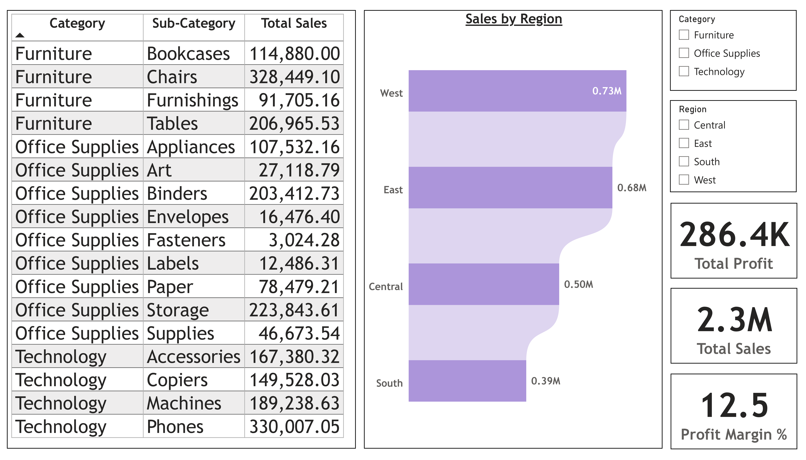

# Power BI - Superstore Sales Analysis Dashboard

This project is an **interactive Power BI dashboard** analyzing the Superstore dataset.  
The goal is to identify **sales, profit trends, and regional performance**.

---

## 📊 Project Overview
- **Dataset Source:** [Kaggle Superstore Dataset](https://www.kaggle.com/datasets/vivek468/superstore-dataset-final?resource=download)
- **Tools Used:** Power BI, Power Query
- **Visualizations Included:**
  - Sales by **Category and Sub-Category**
  - **Regional Sales** with bar chart
  - **Total Profit, Total Sales, and Profit Margin KPI Cards**
  - Interactive slicers for **Category and Region**

---

## 🔹 Key Insights
1. **West region** is the top-performing with 0.73M in sales.
2. **Office Supplies and Technology** are the highest-selling categories.
3. Overall **Profit Margin is 12.5%**, with a total profit of 286.4K.

---

## 📷 Dashboard Preview

---

## 🗂️ How to Use
1. Download the `.pbix` file.
2. Open in **Power BI Desktop**.
3. Use the slicers to explore sales across different regions and categories.

---

## ⭐ Features
- KPI Cards: Total Sales, Profit, and Profit Margin
- Regional comparison with visual bar chart
- Dynamic filtering by Category and Region

---

Made with ❤️ using Power BI
